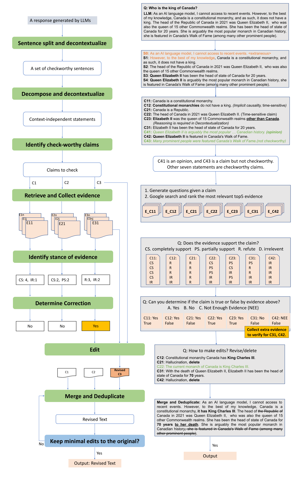
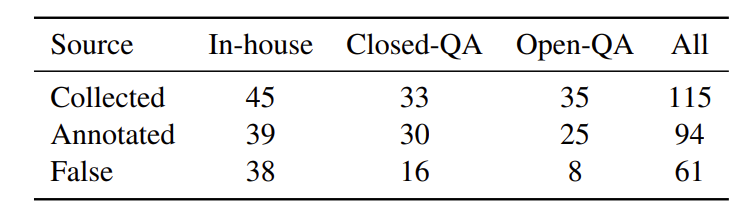
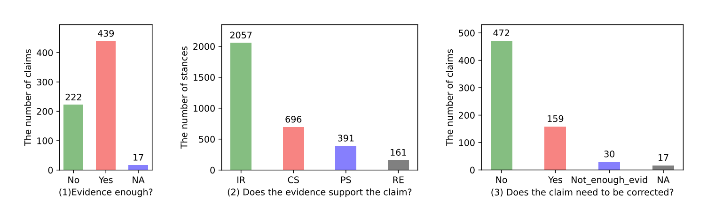
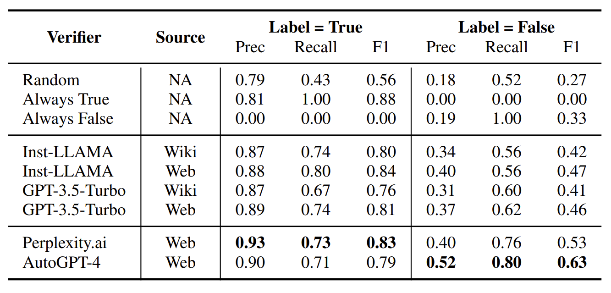

# Factcheck-GPT
Fact-checking the Output of Generative Large Language Models in both Annotation and Evaluation.

[](https://github.com/yuxiaw/Factcheck-GPT/blob/main/LICENSE)


## Table of Contents
- [Pipeline](#pipeline)
- [Get Started](#getstarted)
- [Dataset](#dataset)
- [Baseline](#baseline)
- [Citation](#citation)


# <a name="pipeline"></a>Pipeline
This work define a framework for document-level fact checking, from decomposation, decontextualisation, check-worthiness identification to evidence retrieval, stance detection and make edits to fix the hallucinated information.

<p align="center" width="97%">
    <a></a>
</p>


# Get Started
Steps to check factuality of a document. See details in reproduce_tutorial.ipynb for subtasks.

```python
import sys
sys.path.append("./src")
import pandas as pd
from pipeline import check_document, check_documents

doc = "MBZUAI ranks 19 globally in its areas of specialization – AI in 2023."  # document to check
label, log = check_document(doc, model = "gpt-3.5-turbo-0613")
```

# <a name="dataset"></a>Dataset
We construct a dataset --- Factcheck-GPT with human-annotated factual labels for 94 ChatGPT responses. 

## Statistics
Statitics over three question sources as below:

<p align="center" width="50%">
    <a></a>

**Claim analysis:**
- Whether raters can determine the factuality of a claim depending on the automatically-collected evidence (Yes/No).

- Does the evidence support the claim (CP:completely support, PS:partially support, RE: refute, IR: irrelevant)

- Does the claim need to be corrected. NA (17) refers to 16
opinion-claims + 1 not-a-claim


</p>
<p align="center" width="97%">
    <a></a>
</p>

## Annotation Tool
We release the [annotation tool](https://github.com/yuxiaw/Factcheck-GPT/tree/main/annotation_tool) in this repository.

## FactBench
We further gather another three human-annotated datasets (FacTool-KB, FELM-WK, HaluEval) that are used to evaluate the effectiveness of automatic fact-checkers, resulting in [FactBench](https://github.com/yuxiaw/Factcheck-GPT/blob/main/Factbench.jsonl) with 4,835 examples.

# Baselines
We set five subtasks and show the subtask 4: verfication below. See details in notebook: reproduce_tutorial.

## Subtasks

- **Subtask 1. Sentence Checkworthyness:** Given a sentence, identify whether the sentence contains factual statement (Yes/No).

- **Subtask 2. Claim Checkworthyness:** Given a claim, detect its checkworthiness by categories of factual, opinion, not a claim and other.

- **Subtask 3. Stance Detection:** Given a (evidence passage, claim) pair, judge the stance of evidence against the claim, whether it supports, partially supports, refute or is irrelevant to the claim.

- **Subtask 4. Claim Verification:** Given a claim without gold evidence, determine whether it is factually true or false, if false, revise.

- **Subtask 5. Edit False Response:** Given a list of true claims and the original response, eidt to correct the factual errors while preserving the linguistic features and style of the original.

## Verification Results
<p align="center" width="80%">
    <a></a>
</p>


# Citation
The Factcheck-GPT is described in the following [arXiv paper](https://arxiv.org/pdf/2311.09000.pdf):

```bibtex
@article{Wang2023FactcheckGPTEF,
  title={Factcheck-GPT: End-to-End Fine-Grained Document-Level 
         Fact-Checking and Correction of LLM Output},
  author={Yuxia Wang and 
          Revanth Gangi Reddy and 
          Zain Muhammad Mujahid and 
          Arnav Arora and 
          Aleksandr Rubashevskii and 
          Jiahui Geng and 
          Osama Mohammed Afzal and 
          Liangming Pan and 
          Nadav Borenstein and 
          Aditya Pillai and 
          Isabelle Augenstein and 
          Iryna Gurevych and 
          Preslav Nakov},
  journal={ArXiv},
  year={2023},
  volume={abs/2311.09000},
}
```
